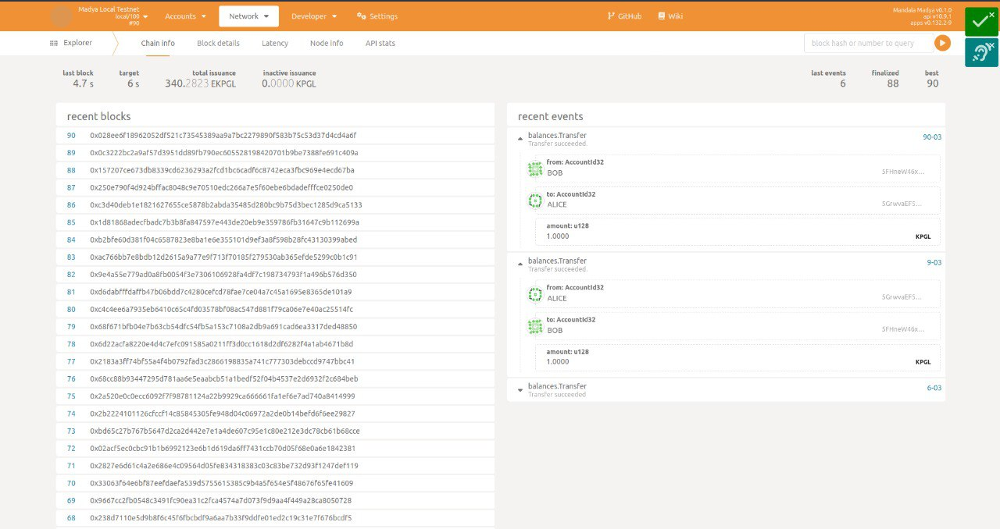

# Running A Local Network

Now, let's spin up a local network on a standalone node.

## Get the Latest Binary <a href="#get-the-latest-binary" id="get-the-latest-binary"></a>

You can obtain the latest binary in one of the following ways:

* Download the latest binary from GitHub.
* Build it from the source.

If you would like to download the binary, visit the Release page of the [Madya Mandala Github repository](https://github.com/MandalaChain/madya/releases). There, you can find the pre-built binaries for MacOS and Ubuntu, as well as Docker images. If you prefer to build it from the source,[ this readme ](https://github.com/MandalaChain/madya#getting-started)can guide you through the process.

After you obtain the binary, you can rename the file to `madya`, and add execution permission by running the following command:

```
chmod +x ./madya-solo
```

You should then be able to execute the binary. To see whether you can run the node, let's check the binary version.

```
./madya --version
# madya-solo xxx
```

## Run the Local Network[​](https://docs.astar.network/docs/build/environment/local-network#run-the-local-network) <a href="#run-the-local-network" id="run-the-local-network"></a>

You are now ready to run the local network, using the following command:

```
./madya-solo --port 30333 --rpc-port 9944 --rpc-cors all --alice --dev
```

What this command means:

* Use port 30333 for P2P TCP connection
* Use port 9944 for WebSocket/Http connection
* Accept any origin for HTTP and WebSocket connections
* Enable Alice session keys
* Launch network in development mode

You can see the full list of the command options using the `help` subcommand:


```
./madya-solo help
# madya-solo xxx
# 
# MadyaSolo <support@mandalachain.io>
# Madya solo
# ...
```

When you have successfully launched the local network, you will see the messages in your terminal.

## Access Your Local Network via Polkadot.js Apps Portal <a href="#access-your-local-network-via-polkadotjs-apps-portal" id="access-your-local-network-via-polkadotjs-apps-portal"></a>

Visit the following URL:

[https://polkadot.js.org/apps/?rpc=ws%3A%2F%2F127.0.0.1%3A9944#/explorer](https://polkadot.js.org/apps/?rpc=ws%3A%2F%2F127.0.0.1%3A9944#/explorer)

There, you will see the following screen:

<figure><figcaption></figcaption></figure>

This represents your local network. In this local network, some native tokens have already been issued to a few accounts. Let's visit the [Account page](https://polkadot.js.org/apps/?rpc=ws%3A%2F%2F127.0.0.1%3A9944#/accounts) from the Accounts Tab.

There, you can see that ALICE and BOB have around 1,000,000 tokens. In the following section, you will deploy your smart contract and interact with it by paying the transaction fees using these tokens.
