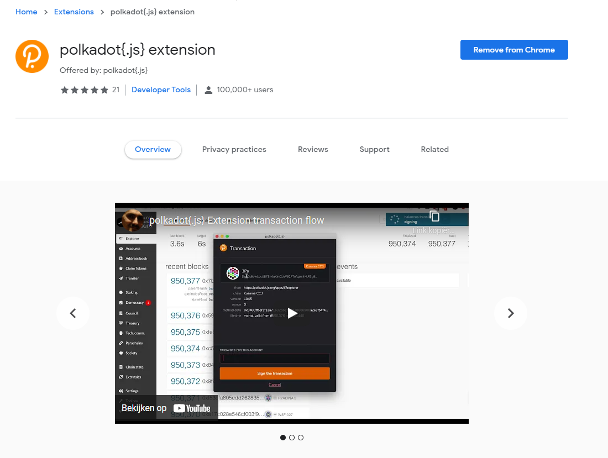
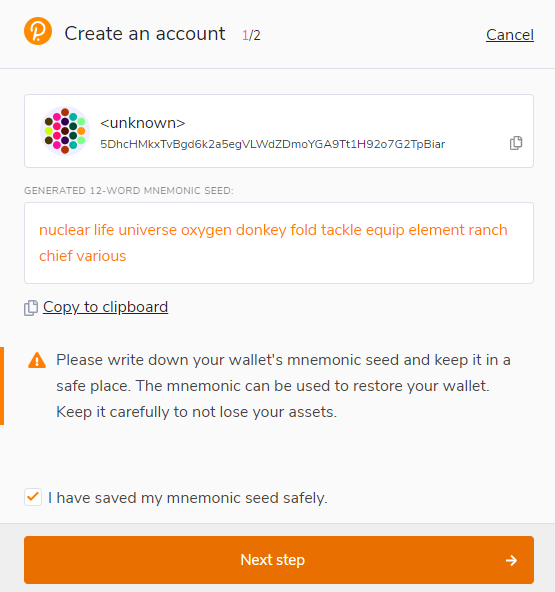
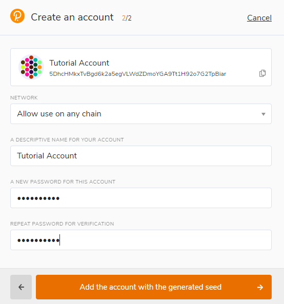

# Wallets

## Connect your wallet to Niskala[​](https://docs.astar.network/docs/use/manage-wallets/create-wallet#connect-your-wallet-to-astar-portal) 

## MetaMask App

MetaMask is a popular Ethereum wallet and browser extension that allows users to manage their accounts, send transactions, and interact with decentralized applications (dApps).&#x20;

Here’s a step-by-step guide on how to set up and use MetaMask with Niskala:

#### Step 1: Install MetaMask

<figure><figcaption></figcaption></figure>

1. **Download MetaMask**: Visit the [MetaMask website](https://metamask.io/) and download the extension for your preferred browser (Chrome, Firefox, Brave, or Edge).
2. **Install the Extension**: Follow the installation instructions provided by your browser to add MetaMask as an extension.
3. **Create or Import an Account**: Once installed, open MetaMask and either create a new Ethereum account or import an existing one using your seed phrase.

#### Step 2: Connect MetaMask to Niskala

1. **Open MetaMask**: Click on the MetaMask icon in your browser to open the extension.
2. **Add Niskala Network**: Click button Add Niskala and verify network details.

<figure><figcaption></figcaption></figure>

* **Network Name**: Niskala Network
* **Network RPC URL**: [`https://mlg1.mandalachain.io/`](https://mlg1.mandalachain.io/)
* **Chain ID**: `6025` (replace with the actual chain ID)
* **Currency Symbol**: KPGT

#### Step 3: Interact with Niskala

1. **Approve and Switch to Niskala Network**: Ensure that you are connected to the Niskala network

<figure><figcaption></figcaption></figure>

2. **Manage Your Account**: You can now view your Niskala account balance, send transactions, and interact with dApps on the Niskala network.

By following this guide, users can effectively manage their Niskala accounts using MetaMask and take advantage of the blockchain's Ethereum compatibility.

***

## Polkadot JS App

### Polkadot{.js} Browser Plugin[​](https://docs.astar.network/docs/use/Manage%20wallets/create-wallet#recommend-polkadotjs-browser-plugin) 

Here’s a step-by-step guide on how to set up and use Polkadot {.js} with Niskala:

The browser plugin is available for both [Google Chrome](https://chrome.google.com/webstore/detail/polkadot%7Bjs%7D-extension/mopnmbcafieddcagagdcbnhejhlodfdd?hl=en) (and Chromium-based browsers like Brave) and [Firefox](https://addons.mozilla.org/en-US/firefox/addon/polkadot-js-extension). After installing the plugin, you should see the orange and white Polkadot{.js} logo in your browser menu bar.&#x20;

<figure><figcaption></figcaption></figure>

### Create Account

Open the Polkadot{.js} browser extension by clicking the logo on the top bar of your browser. You will see a browser popup.

\

<figure><figcaption></figcaption></figure>

Click the big plus button - "Create new account." The Polkadot{.js} plugin will then use system randomness to make a new seed for you and display it to you in the form of twelve words.

<figure><figcaption></figcaption></figure>

You need to back up these words. Please store the seed somewhere safe and secure. If you cannot access your account via Polkadot{.js} for some reason, you can re-enter your seed through the "Add account menu" by selecting "Import account from pre-existing seed".

<figure><figcaption></figcaption></figure>

It is best to create an account that is allowed on _any chain_ in the Mandala Chain ecosystem. This account can then be used for Niskala. Your account will automatically change format when connected to a chain.

A **descriptive name** is arbitrary and for your use only. It is not stored on the blockchain and will not be visible to other users who look at your address via a block explorer. If you're juggling multiple accounts, it helps to make this as descriptive and detailed as needed.

The **password** will be used to encrypt this account's information. You will need to re-enter it when using the account for any outgoing transaction or to cryptographically sign a message.

> DANGER
>
> Note that this password does **NOT** protect your _**seed phrase**_. If someone knows the twelve words in your mnemonic seed, they still have control over your account even if they do not know the password.

After clicking on "Add the account with the generated seed", your account is created. We recommend also saving your account as a JSON file somewhere safe.

***

### Support 

In case you have any problems, our team can provide support. Please remember that we will NEVER DM you first and we will never ask for any funds or tokens! If you get approached by someone _pretending_ to be part of the team, do NOT engage with them. Instead, please reach out to us using our official support email: [support@mandalachain.io](mailto:support@mandalachain.io)&#x20;
