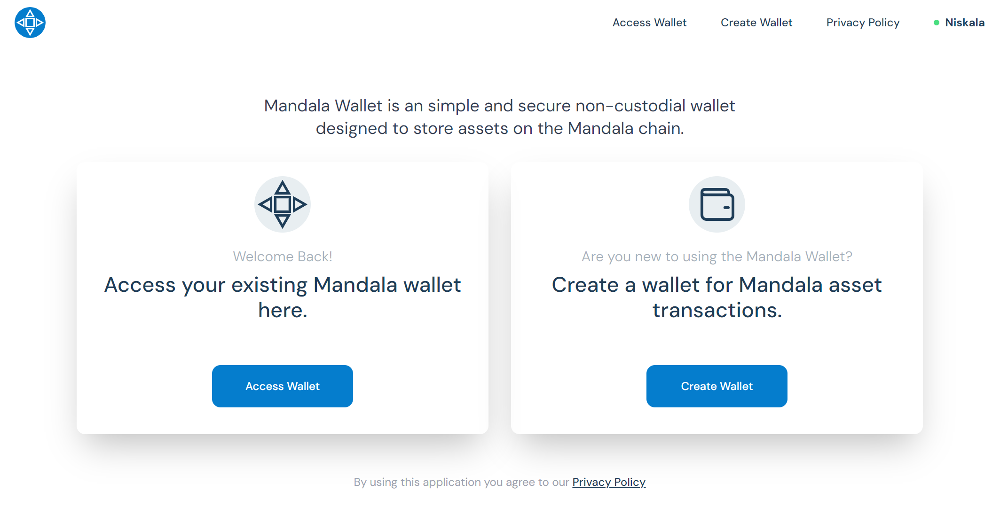
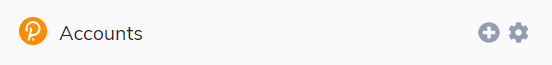

# Wallets

## Mandala Wallet

### Step 1

Head over to our [Mandala Wallet](https://wallet.mandalachain.io/) website and click on the **Create Wallet** button.

<figure><figcaption></figcaption></figure>

### Step 2

Get your **Key Phrase** stored in a _**secure**_ location. You may copy them into Clipboard and paste them somewhere else temporarily, or (preferred) write them down on paper and keep them accessible by yourself only.&#x20;

<figure><figcaption></figcaption></figure>

> <mark style="color:red;">**WARNING!**</mark>
>
> Losing your **Key Phrase** means you will lose all your assets or if someone can access your **Key Phrase** inadvertently, that also means they will gain control to your assets. Be sure to store them in secure location and if you really want to share them, please be sure you do it with full awarenes.

### Step 3

Confirm that you've already stored your Key Phrase by confirming any key required. Verify those keys by selecting all the correct key phrases.

<figure><figcaption></figcaption></figure>

<figure><figcaption></figcaption></figure>

### Step 6

Give your wallet a **name** and **password**.

<figure><figcaption></figcaption></figure>

### Step 7

You wallet should be set up, and you can click on the Continue button to start using it.

<figure><figcaption></figcaption></figure>

## Polkadot JS App

### Polkadot{.js} Browser Plugin[​](https://docs.astar.network/docs/use/Manage%20wallets/create-wallet#recommend-polkadotjs-browser-plugin) 

The browser plugin is available for both [Google Chrome](https://chrome.google.com/webstore/detail/polkadot%7Bjs%7D-extension/mopnmbcafieddcagagdcbnhejhlodfdd?hl=en) (and Chromium-based browsers like Brave) and [Firefox](https://addons.mozilla.org/en-US/firefox/addon/polkadot-js-extension). After installing the plugin, you should see the orange and white Polkadot{.js} logo in your browser menu bar.

<figure><figcaption></figcaption></figure>

### Create Account

Open the Polkadot{.js} browser extension by clicking the logo on the top bar of your browser. You will see a browser popup.

\

<figure><figcaption></figcaption></figure>

Click the big plus button - "Create new account." The Polkadot{.js} plugin will then use system randomness to make a new seed for you and display it to you in the form of twelve words.

<figure><figcaption></figcaption></figure>

You need to back up these words. Please store the seed somewhere safe and secure. If you cannot access your account via Polkadot{.js} for some reason, you can re-enter your seed through the "Add account menu" by selecting "Import account from pre-existing seed".

<figure><figcaption></figcaption></figure>

It is best to create an account that is allowed on _any chain_ in the Mandala Chain ecosystem. This account can then be used for Utama and Madya. Your account will automatically change format when connected to a chain.

A **descriptive name** is arbitrary and for your use only. It is not stored on the blockchain and will not be visible to other users who look at your address via a block explorer. If you're juggling multiple accounts, it helps to make this as descriptive and detailed as needed.

The **password** will be used to encrypt this account's information. You will need to re-enter it when using the account for any outgoing transaction or to cryptographically sign a message.

> DANGER
>
> Note that this password does **NOT** protect your _**seed phrase**_. If someone knows the twelve words in your mnemonic seed, they still have control over your account even if they do not know the password.

After clicking on "Add the account with the generated seed", your account is created. We recommend also saving your account as a JSON file somewhere safe.

### Support 

In case you have any problems, our team can provide support. Please remember that we will NEVER DM you first and we will never ask for any funds or tokens! If you get approached by someone _pretending_ to be part of the team, do NOT engage with them. Instead, please reach out to us using our official support email: [support@mandalachain.io](mailto:support@mandalachain.io)&#x20;
